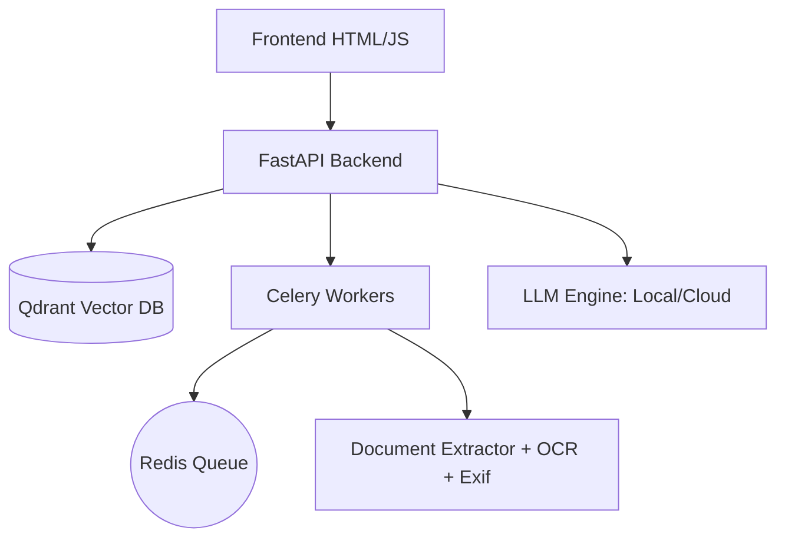

# MeigaSearch

**Un buscador corporativo basado en RAG y búsqueda semántica local, sin dependencias en APIs externas.**


## 🎯 Propósito

MeigaSearch resuelve el problema de búsqueda a través de documentos corporativos dispersos (PDFs, Excel, Word, PPTX, CSV, texto, imágenes). Utiliza modelos de IA locales para indexación y búsqueda semántica, manteniendo la soberanía de los datos sin depender de servicios en la nube.

## ✨ Características Principales

- **Ingesta Mágica**: Sube documentos y se indexan automáticamente con OCR avanzado (Tesseract) y extracción de metadatos técnicos (ExifTool).
- **Global RAG Chat**: Chatea con toda tu base de conocimientos mediante **Streaming (SSE)** y obtén respuestas con **citas precisas** a los documentos originales.
- **Búsqueda Híbrida Inteligente**: Combina búsqueda semántica (vectores) + búsqueda léxica (exacta) en paralelo para obtener resultados óptimos.
- **Inferencia de Categorías**: Clasificación automática del contenido en áreas como RRHH, Finanzas, Legal, Técnico, Comercial, Sostenibilidad e IT.
- **Provider-Agnostic LLM**: Soporte dinámico para proveedores locales (Qwen/SmolLM) y externos (OpenAI, Gemini, Claude) configurable en caliente.
- **Filtros Avanzados**: Búsqueda por autor, mes, año, creador del documento y metadatos técnicos específicos.
- **Autenticación JWT**: Control de acceso por roles (admin, editor, normal) con cifrado `bcrypt`.
- **Arquitectura Robusta**: Qdrant como base de datos vectorial y Celery + Redis para procesamiento asíncrono.

## � Formatos Soportados

| Tipo | Extensiones |
| :--- | :--- |
| **Documentos** | `.pdf`, `.docx`, `.pptx`, `.txt`, `.md`, `.html` |
| **Datos** | `.csv`, `.xlsx`, `.json`, `.xml` |
| **Imágenes** | `.png`, `.jpg`, `.jpeg` |

## 🚀 Instalación Rápida

### Con Docker Compose (Recomendado)

1. **Configura el entorno:**
   ```bash
   cd meiga-search/backend
   cp .env.example .env  # Configura tus API Keys si usas modelos externos
   ```

2. **Levanta los servicios:**
   ```bash
   docker compose up -d
   ```

3. **Accede a la interfaz:**
   - **Frontend**: [http://localhost:8000](http://localhost:8000)
   - **API Docs (Swagger)**: [http://localhost:8000/docs](http://localhost:8000/docs)

### Credenciales por defecto

| Usuario | Password | Rol |
| :--- | :--- | :--- |
| `admin` | `admin123` | Administrador |
| `empleado` | `normal123` | Normal |

## ⚙️ Configuración del LLM

Puedes cambiar el proveedor de inteligencia artificial en tiempo real desde el panel de administración o mediante la API:

```bash
curl -X POST http://localhost:8000/api/system/settings \
  -H "Authorization: Bearer ADMIN_TOKEN" \
  -H "Content-Type: application/json" \
  -d '{
    "provider": "gemini",
    "api_key": "YOUR_GEMINI_KEY",
    "model_name": "gemini-1.5-pro"
  }'
```

Proveedores soportados: `local`, `openai`, `gemini`, `claude`.

## 📖 Uso de la API Search

**Endpoint:** `GET /api/search`

**Parámetros:**
- `q`: Consulta de búsqueda (ej. "factura de electricidad")
- `mode`: `semantic` (default) o `text` (exacto)
- `month` / `year`: Filtrado cronológico
- `type`: `pdf`, `txt`, `csv`, `xlsx`, `image`
- `author`: Filtrar por autor extraído de metadatos

## 🏗️ Arquitectura



## 🧪 Testing

```bash
cd meiga-search/backend
pytest tests/
```

## 📄 Licencia

MeigaSearch se distribuye bajo la licencia **Apache 2.0**. Ver [LICENSES/Apache-2.0.txt](LICENSES/Apache-2.0.txt).

---
Desarrollado durante la Hackathon 2026. Profesionalmente adaptado para entornos corporativos seguros.
